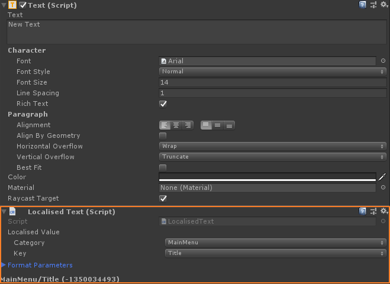

# Basic Usage

## Contents
* [Localised objects/components](#localised-objectscomponents)
* [Retrieving a localised string in code](#retrieving-a-localised-string-in-code)
* [Change language at runtime](#change-language-at-runtime)
* [Extending LocalisedObject](#extending-localisedobject)

## Localised objects/components
With localised components you may need to ensure that the schema is set and that the tables were refreshed before you will be able to configure it. [See also](https://github.com/dubit/unity-localisation/issues/5)

There are 3 LocalisedObjects that come ready to use, They are `LocalisedText`, `LocalisedImage`, and `LocalisedAudio`.
They work in conjunction with `Text`, `Image` and `AudioSource` respectively.

To configure it add the base component (`Text`, `Image` or `AudioSource`), then add the localised component counterpart

Set the category and the key. and press the set button. (The UI is the same for all 3)

The actual content of each type is still a string. The audio & image components treat this localised string as a path and attempt to load a sprite or audio source for the corresponding value.



## Retrieving a localised string in code
`Localiser.GetLocalisedString(Loc.MainMenu.MainMenuTitle);`

## Change language at runtime

`Localiser.SwitchLocale("fr"); // switch to French`

This will automatically update any localisation-sensitive components.

## Extending AbstractLocalisedObject
In some situations you may want to set the text, sprite, or audio on a different component other than `Text`, `Image` or `AudioSource`.

For example you may want to set the text on a `TextMeshPro` object. To accomplish this just extend `AbstractLocalisedObject` and make the relevant changes.
#endif
eg:

```c#
[RequireComponent(typeof(TextMeshProUGUI))]
[ResourceType(LocalisedResourceType.Text)]
public class LocalisedText : AbstractLocalisedObject<TextMeshProUGUI>
{
    // Called whenever locale changes (and when the component awakes)
    protected override void HandleLocaleChanged(bool translationFound, string localisedString)
    {
        Component.text = translationFound ? localisedString : $"<color=red>{localisationKey}</color>";
    }
}
```

Above we specified the type parameter `TextMeshProUGUI` when inheriting `AbstractLocalisedObject<>`.
This specifies the type of component that this lcoaliser component will accompany and is used to obtain a reference to it which is accessible through the `Component` property.

You must also specify the resource type using the attribute class `[ResourceType(LocalisedResourceType.Text)]`. This tell us which categories to display when drawing the inspector GUI.

Note: we cannot provide this as part of the package without introducing a dependency on the TextMeshPro assembly, otherwise we would ship this library with this component.
