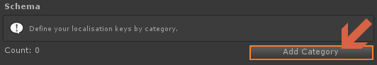
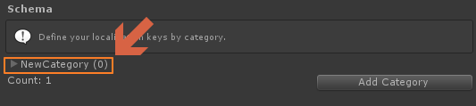
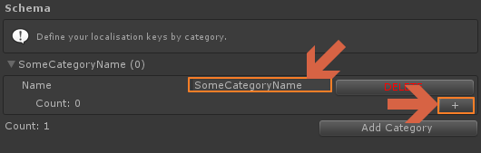
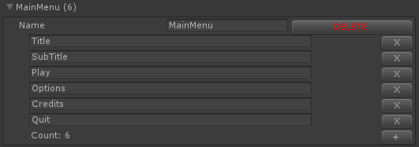
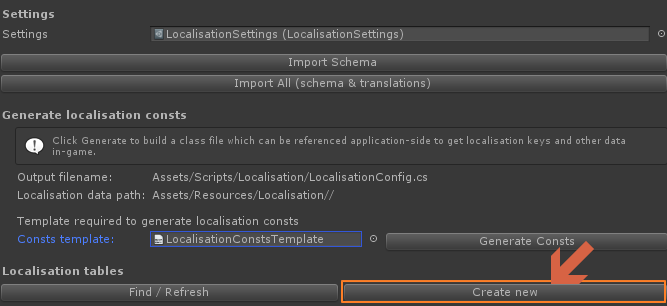

# Getting Started

## Contents

1. [Create the localisation key schema](#create-the-localisation-key-schema)
2. [Generate code](#generate-code)
3. [Populate Data](#populate-data)
4. [Initialization](#initialization)
5. [Next Steps](#next-steps)

## Create the localisation key schema
**Step 1**

Open the Localisation Window via the toolbar. `DUCK -> Localisation`

**Step 2**

In the localisation window click "Create new empty key schema". 

This creates a new `LocalisationKeySchema.asset` config file in the currently selected directory. Place this anywhere you like or rename it. **You will only need one of these for your project**
Think of this schema as a master localisation dictionary for your project. 
The schema stores all the categories and localisation keys that you will use in your project. Each piece of localised content should have a key in here and belong to a category.

**Step 3**

Select the newly created LocalisationKeySchema, Add some categories via the inspector. A category is a set of related localisation keys. They are related by the type content (eg DialogueTexts, ButtonTexts, ErrorMessages etc..) but also by the type of media (eg Text, Audio, Image).
Some Example Categories are shown below:
* MainMenu
* OptionsMenu
* DialogueText
* DialogueAudio
* CharacterNames
* CharacterNamesAudio
* ItemsNames
* LevelNames
* LevelThumbnails
    
Create a new category

Expand the category

Congfigure and add keys to the category

Example of populated category "MainMenuText"

## Generate code
Once the schema is populated with meaningful categories keys. It's time to generate a little bit of code. The system generates a class containing all categories/keys as enums, whose values are encoded as crc values for faster access. Through this class your code can refer to any localisation key, in a type safe manner. It also allows the localised components to show a dropdown UI to select the keys.

Any time you change the schema you will need to regenerate this file.

To generate the file open the Localisation window again and drag the KeySchemaAsset into the slot.

Once this field has been assigned the window will look like this:

To generate the config class first you need to assign a template. This is just a text asset. One is provided with this package "LocalisationConfigTemplate" but you may want to use your own to conform with your own coding style. Assign a emplate and then clik the button "Generate Config Class" (marked "2" in the image above)
This will generate the config file and save it to the location specified in the [preferences](./Preferences.md).

## Populate Data
Now we need to populate some localisation tables, so our keys actually have some values against them.

In the localisation window click "Find/Refresh."
 

This automatically searches the project for existing tables and checks them for missing values. It will show any tables that have missing values. This can happen when you add new keys but haven't added the values yet.

To create a new table click "Create new"

This creates a table in the location specified in [preferences](./Preferences.md).

This table asset represents the entire set of translation data for a set of locales. Name it "English" (for example).

Select the table and then in the inspector there are a few options. Shown below:

.

1) Configure which locales are supported by this table. In many cases this is only a single locale, however it allows multiple so a single set of translations can be used to support multiple regions. In our example the "English" table supports `en-US` & `en-GB`. It could also support any number of english speaking countries, however there isn't anything stopping us from splitting it and having unique tables for American & UK English.

2) Save & Load options allow us to import data and export data from CSVs. There is also an option "Empty values only" which allows us to generate a CSV showing the keys that are missing. For more info about Import/Export see [Importing & Exporting](./Docs/ImportingAndExporting.md).

3) Allows us to view & edit the values stored agains the keys, grouped by categories. The options above also allow us to toggle viewing CRC values for each key, and shows us the CRC version used.

## Initialization

At the start of the app call the following function.

`Localiser.Initialise("Localisation"); // default: looks in Resources/Localisation and starts in the user's device language`

or alternatively...

`Localiser.Initialise("OtherFolderNameInResources"); // to look for tables in a folder other than Resources/Localisation`
`Localiser.Initialise("Localisation", "en-GB"); // to set a specific starting language`

In most cases, your default table should have both en-GB and en-US supported, and the localiser will retrieve all compatible tables from this folder.

## Next steps
It's now ready to use. See [Basic Usage](./Docs/BasicUsage.md).